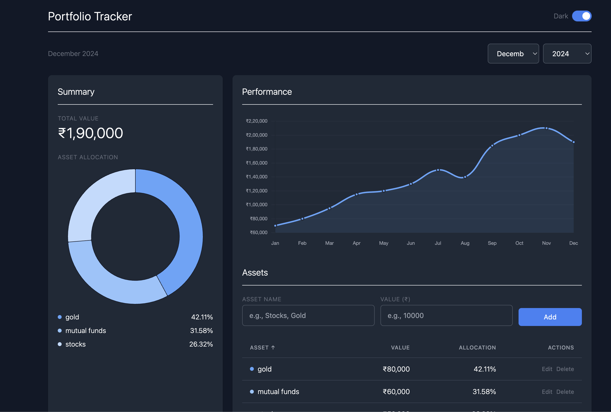
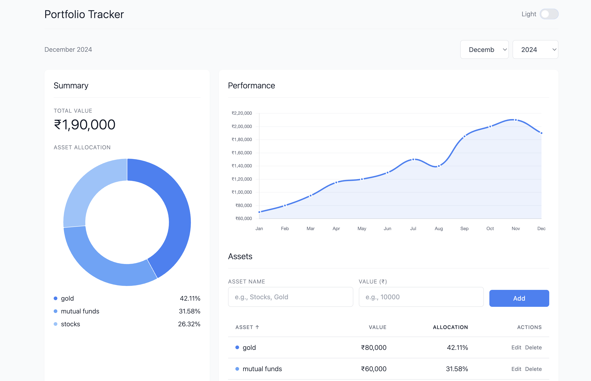

# Portfolio Tracker

A web application for tracking and visualizing your asset portfolio over time.

## Features

- **Asset Management**: Add, edit, and delete assets in your portfolio
- **Monthly Tracking**: Track your portfolio value month by month
- **Visual Analytics**: View portfolio composition with pie charts
- **Historical Trends**: Track portfolio growth with line charts
- **Time Navigation**: Browse assets by month and year
- **Responsive Design**: Works on desktop and mobile devices

## Tech Stack

- **Frontend**: 
  - React 19
  - Tailwind CSS for styling
  - Chart.js with react-chartjs-2 for data visualization
  - Axios for API requests

- **Backend**: 
  - Node.js
  - Express.js for REST API
  - SQLite3 for database storage

- **Deployment & DevOps**: 
  - Docker & Docker Compose for containerization
  - Nginx as web server for production build

## Screenshots
### Dashboard





## Disclaimer

This application was developed with the assistance of GPT-4.0 and Claude 3.7. It is not production-ready and is intended for personal use only. The app is designed to be run locally on the user's computer. Please note that it may have vulnerabilities, as the author is not an expert in React and Node.js.

## Getting Started

### Prerequisites

- Node.js (v14 or higher)
- npm or yarn

### Installation

#### Method 1: Manual Installation

1. Clone the repository
   ```
   git clone https://github.com/yourusername/Portfolio_tracker.git
   cd Portfolio_tracker
   ```

2. Install backend dependencies
   ```
   cd backend
   npm install
   ```

3. Install frontend dependencies
   ```
   cd ../frontend
   npm install
   ```

4. Start the backend server
   ```
   cd ../backend
   node server.js
   ```

5. Start the frontend development server
   ```
   cd ../frontend
   npm start
   ```

6. Open your browser and navigate to `http://localhost:3000`

#### Method 2: Docker Deployment

1. Ensure Docker and Docker Compose are installed on your system

2. Clone the repository
   ```
   git clone https://github.com/yourusername/Portfolio_tracker.git
   cd Portfolio_tracker
   ```

3. Run the application using Docker Compose
   ```
   docker-compose up
   ```

4. Open your browser and navigate to `http://localhost:3000`

## Usage Guide

1. **Adding Assets**: Click the "Add Asset" button and fill in the name and value
2. **Viewing Monthly Data**: Use the month/year selector to browse different time periods
3. **Editing Assets**: Click the edit icon next to any asset to update its value
4. **Deleting Assets**: Click the delete icon to remove an asset from your portfolio
5. **Viewing Charts**: Toggle between different chart views to analyze your portfolio


## API Endpoints

- `GET /portfolio` - Get all assets (optionally filtered by month/year)
- `POST /portfolio` - Add a new asset
- `PUT /portfolio/:id` - Update an asset
- `DELETE /portfolio/:id` - Delete an asset
- `GET /portfolio/months` - Get list of months with data
- `GET /portfolio/years` - Get list of years with data

## License

This project is open source under the following conditions:

- Free to use, modify, and distribute for non-commercial purposes.
- Attribution to the original author is required for any modifications or derivative works.
- Commercial use or significant modifications require explicit approval from the author.

For more details, see the [LICENSE](./LICENSE) file.

## Contributing

Contributions are welcome! Please feel free to submit a Pull Request.